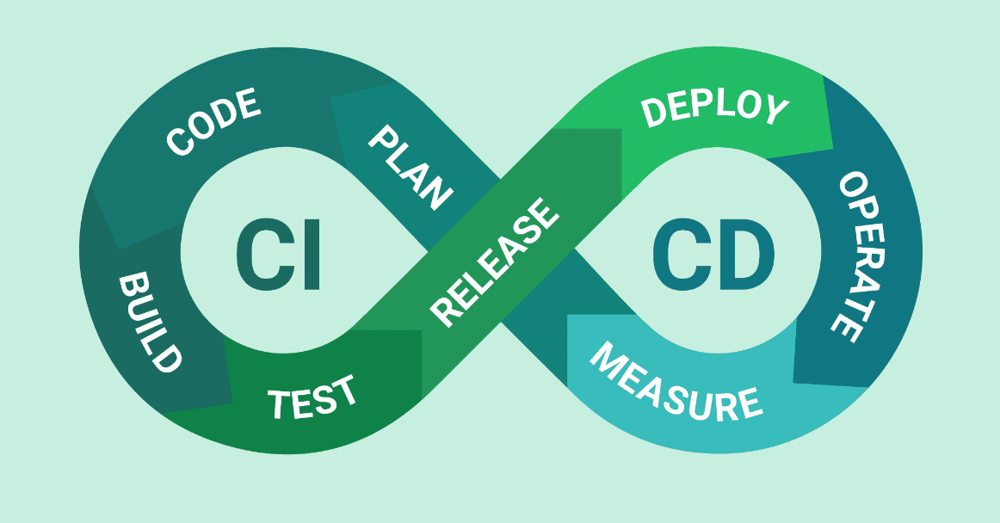

# 1. CI/CD란?

애플리케이션 개발 단계를 **자동화**하여, 애플리케이션을 더욱 **짧은 주기**로 고객에게 제공하는 방법

2000년대 초 Agile 개발 방법론(빠른 소프트웨어 개발과 빈번한 배포 강조)과 함께 등장

Jenkins, CircleCI, Bamboo 등의 Tool이 있음

## CI

- Continuous Integration = 지속적 통합
    - integration: 소스 코드 병합 (merge)
    - 즉, 코드 변경 사항을 주기적으로 중앙 저장소에 통합하는 관행을 뜻함
- 소스 코드 병합할 때 발생할 수 있는 충돌의 해결 시간을 줄이고자 함
- **빌드 및 테스트 자동화**

## CD - Delivery

- Continuous Delivery = 지속적 제공
- 코드 변경 사항이 자동으로 테스트되고, 프로덕션 환경에 **배포될 준비가 되어 있는 상태**로 유지하는 것
- 빌드, 테스트, 배포 준비 과정은 모두 자동화. but, 실제 프로덕션 환경으로의 배포는 **수동**

## CD - Deployment

- Continuous Deployment = 지속적 배포
    - Delivery의 다음 단계
- 코드 변경 사항이 **자동**으로 프로덕션 환경에 배포되는 과정
- 개발자가 소스 코드를 변경하면, 이 변경 사항은 자동으로 빌드, 테스트되고, 통과되면 바로 프로덕션 환경에 배포됨

### C-Delivery와 C-Deployment**의 차이점**

**배포 과정의 자동화 유무**

- C-Delivery: 배포 준비 과정까지만 자동화
- C-Deployment: 최종 배포까지 모두 자동화

**cf. 프로덕션 환경의 배포 준비 (CI와 C-Delivery의 차이점)**

: 스테이징 환경에서의 테스트, 구성 관리, 데이터베이스 마이그레이션, 서버 환경 설정, 보안 검토 등

# 2. CI/CD의 장점

### 효율성 및 속도 향상

- **빠른 피드백**: CI/CD를 통해 개발자는 코드 변경 사항을 빠르게 통합하고, 자동화된 테스트를 통해 즉각적인 피드백을 받을 수 있음
- **생산성 증가**: 자동화된 프로세스는 반복적인 작업을 줄여 개발자의 개발 생산성을 높임

### 품질 보증

- **코드 품질 향상**: 지속적인 테스팅과 통합은 코드의 품질을 일정하게 유지하도록 돕고, 버그와 오류는 초기 단계에서 발견되어 수정할 수 있음
- **안정적인 배포**: CD를 통해 배포 프로세스가 자동화되면, 프로덕션 환경으로의 안정적인 배포를 보장함

# 3. 무중단 배포

**무중단 배포(Zero-Downtime Deployment)란**?

- 소프트웨어나 시스템을 업데이트하거나 배포할 때 사용자의 서비스 접근에 중단이 발생하지 않도록 하는 접근 방식
- 새로운 버전의 소프트웨어를 프로덕션 환경에 배포하는 동안에도 기존 시스템이 계속해서 정상적으로 작동하고, 사용자에게 서비스가 중단되지 않는 배포 방식

## 1️⃣ 롤링 (Rolling)

사용 중인 인스턴스 내에서 새 버전을 점진적으로 교체하는 방식

순차적으로 라우팅을 끊고, 업데이트 후 다시 라우팅하도록 만듦

### 장점

- 점진적인 배포로 인해 문제가 발생하면 즉시 대응할 수 있음

### 단점

- 배포 진행 시에 구버전과 신버전이 공존하므로, 호환성 문제가 발생할 수 있음
- 라우팅을 끊으며 인스턴스 수가 감소하므로, 특정 인스턴스에 트래픽이 몰릴 수 있음

## 2️⃣ 블루 그린 (Blue Green)

**두 개의 동일한 프로덕션 환경**을 운영하여, 새 버전으로의 전환을 용이하게 하는 방식

: 블루(현재 운영 중인 상태)와 그린(새 버전을 배포할 준비가 된 상태)

‘블루 그룹 처리 → **블루, 그린 그룹 모두 트래픽 처리** → 그린 그룹 처리'의 과정을 거침

### 장점

- 사용자에게 영향을 주지 않고 새 버전을 배포할 수 있음 (배포 중 서비스 중단이 없음)
- 새 버전에 문제가 있을 경우, 이전 버전으로의 롤백이 매우 빠르고 간단함

### 단점

- 두 배포 환경을 유지, 관리해야 하므로 자원이 더 많이 필요함

## 3️⃣ 카나리 (Canary)

새 버전을 소수의 사용자나 서버에 먼저 배포하고, 문제가 발견되지 않으면 나머지 사용자나 서버에 점진적으로 배포하는 방식

### 장점

- 실 사용자에 대한 영향을 최소화하면서 새 버전의 성능과 안정성을 테스트할 수 있음

### 단점

- 롤링 배포와 마찬가지로 새 버전의 전체 배포가 완료될 때까지 구버전과 신버전이 공존할 수 있음

**참고자료**

- [https://jud00.tistory.com/entry/CICD란-무엇일까](https://jud00.tistory.com/entry/CICD%EB%9E%80-%EB%AC%B4%EC%97%87%EC%9D%BC%EA%B9%8C)
- https://www.redhat.com/ko/topics/devops/what-is-ci-cd
- [https://velog.io/@mjhuh263/기술면접준비-Integration-Testing-Unit-Testing-CICD](https://velog.io/@mjhuh263/%EA%B8%B0%EC%88%A0%EB%A9%B4%EC%A0%91%EC%A4%80%EB%B9%84-Integration-Testing-Unit-Testing-CICD)
- https://llshl.tistory.com/47