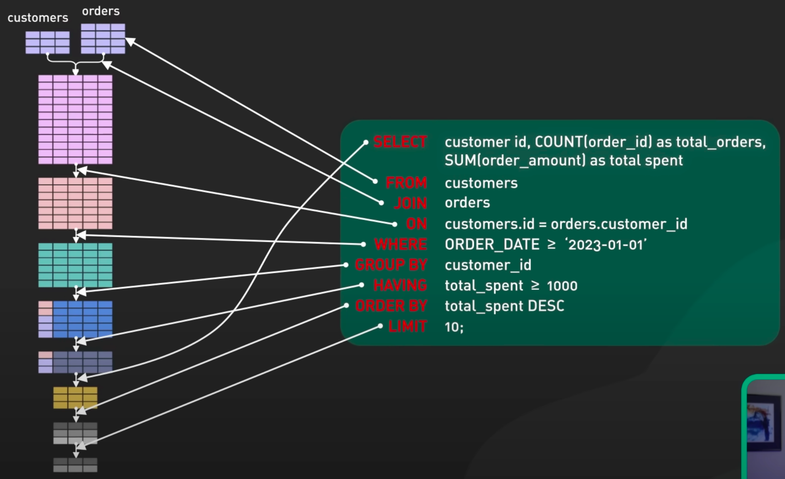

# 0. JOIN이란?

**데이터베이스에서 두 개 이상의 테이블을 연결하여 하나의 결과 테이블로 만드는 방법**

## 특징

- 연결하려는 테이블들이 적어도 하나의 컬럼을 공유하고 있어야 함
- INNER JOIN, OUTER JOIN (LEFT, RIGHT, FULL) 등이 있음


### ON과 WHERE의 차이점


-  JOIN → ON → WHERE 순서로 실행
    - ON 조건에 따라 두 테이의 관련 행이 결합됨
    - JOIN과 ON은 사실상 동시에 처리됨
    - JOIN한 결과에서 WHERE 조건절로 필터링


# 1. INNER JOIN


```sql
SELECT *
FROM A a 
	INNER JOIN B b
	ON a.KEY = b.KEY
```

# 2. OUTER JOIN


- OUTER 생략 가능
- `MYSQL`에서는 FULL OUTER JOIN을 지원하지 않음
    - LEFT JOIN과 RIGHT JOIN을 합쳐서 쿼리를 짜야함

        ```sql
        # 공통 부분 포함
        
        SELECT *
        FROM A a
        	LEFT JOIN B b 
        	ON a.KEY = b.KEY
        
        UNION
        
        SELECT *
        FROM A a
        	RIGHT JOIN B b 
        	ON a.KEY = b.KEY;
        ```

        ```sql
        # 공통 부분 미포함
        
        SELECT *
        FROM A a
        	LEFT JOIN B b 
        	ON a.KEY = b.KEY
        WHERE b.KEY IS NULL
        
        UNION
        
        SELECT *
        FROM A a
        	RIGHT JOIN B b 
        	ON a.KEY = b.KEY
        WHERE a.KEY IS NULL;
        ```

- FULL OUTER JOIN은 많은 양의 NULL 값을 생성할 수 있으며, 큰 데이터 세트에서 성능 저하를 일으킬 수 있음

**INNER JOIN과 OUTER JOIN의 차이점**

- `INNER JOIN`은 두 테이블 간에 **일치하는 행**만 반환
- `OUTER JOIN`은 일치하는 행 뿐만 아니라, 한 쪽 또는 양 쪽 테이블에만 있는 행도 포함하여 반환

# 3. 그 외의 JOIN

## CROSS JOIN


- 한 쪽 테이블의 모든 행과 다른 쪽 테이블의 모든 행을 조인시키는 기능
- CROSS JOIN의 전체 행 개수는 두 테이블의 각 행의 개수를 곱한 수

```sql
SELECT *
FROM A a
    CROSS JOIN B b;
```

## SELF JOIN


- 자기 자신과의 조인 = 1개의 테이블만 사용

```sql
SELECT *
FROM A a1
    INNER JOIN A a2
    ON a1.KEY = a2.KEY;
```

**참고자료**

- https://pearlluck.tistory.com/46
- https://dev-coco.tistory.com/158
- [https://hongong.hanbit.co.kr/sql-기본-문법-joininner-outer-cross-self-join/](https://hongong.hanbit.co.kr/sql-%EA%B8%B0%EB%B3%B8-%EB%AC%B8%EB%B2%95-joininner-outer-cross-self-join/)
- https://jaehoney.tistory.com/191

